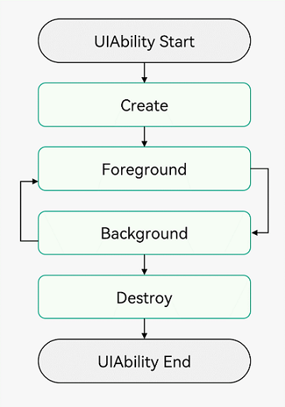

[TOC]

# HarmonyOS NEXT之深入理解应用程序框架

掌握UIAbility的概念及其在HarmonyOS应用开发中的重要性。理解UIAbility内页面的跳转和数据传递机制，掌握如何在应用内实现页面间的顺畅切换和数据交换。深入学习UIAbility的生命周期，理解如何有效地管理应用的生命周期状态，以优化应用性能和提供更好的用户体验。

了解应用组件相关的基本概念和设计思想，并掌握UIAbility组件的启动模式和UIAbility组件间的交互机制，能够在实际开发中灵活运用。了解应用程序包结构设计思想，掌握其组织和配置的方法。了解两种共享包并掌握静态共享包HAR和动态共享包HSP的开发使用。


**本篇所有内容基于Stage框架。**

## UIAbility
### 1. 概述
UIAbility组件是一种包含UI的应用组件，主要用于和用户交互；是应用程序入口和系统调度单元。

一个应用可以包含一个或多个UIAbility组件。

### 2. UIAbility的生命周期
* Create（创建）
* Distroy（销毁）
* Foreground（前台）
* Background（后台）




### 3. UIAbility页面跳转 
#### 跳转到次级页面

* 第一种方式：`router.pushUrl()`
```
router.pushUrl({
  url: 'pages/Next',
  params: {
    src: '',
  }
}, router.RouterMode.Single)
```

* 第二种方式：`router.replaceUrl()`
```
router.replaceUrl({
  url: 'pages/Second',
  params: {
    src: '',
  }
}, router.RouterMode.Single)
```

其中`params`为跳转页面时传递的参数，在次级页面获取上级页面传递过来的参数：

```
@State src: string = (router.getParams() as Record<string, string>)['src'];
```

#### 返回页面

* 返回到上一级页面
```
Router.back()
```

* 返回到指定页面
```
Router.back( { url: 'pages/Home' } )
```

### 4. UIAbility的启动模式
系统提供了三种启动模式：singleton（单实例模式）、multiton（多实例模式）和specified（指定实例模式）。
* 单实例模式（默认）
每次调用`startAbility()`方法时，如果应用进程中该类型的UIAbility实例已经存在，则复用系统中的UIAbility实例，否则会创建一个UIAbility实例。系统中只存在唯一一个该UIAbility实例，即在最近任务列表中只存在一个该类型的UIAbility实例。
* 多实例模式
每次调用`startAbility()`方法时，都会在应用进程中创建一个新的该类型UIAbility实例。即在最近任务列表中可以看到有多个该类型的UIAbility实例。
* 指定实例模式
针对一些特殊场景使用，开发者可以为该实例指定一个唯一的字符串Key，这样在调用`startAbility()`方法时，应用就可以根据指定的Key来识别响应请求的UIAbility实例。

```ts
// 在启动指定实例模式的UIAbility时，给每一个UIAbility实例配置一个独立的Key标识
// 例如在文档使用场景中，可以用文档路径作为Key标识
import common from '@ohos.app.ability.common';
import hilog from '@ohos.hilog';
import Want from '@ohos.app.ability.Want';
import { BusinessError } from '@ohos.base';

const TAG: string = '[Page_StartModel]';
const DOMAIN_NUMBER: number = 0xFF00;

function getInstance() : string {
  return 'KEY';
}

@Entry
@Component
struct Page_StartModel {
  private KEY_NEW = 'KEY';
  build() {
    Row() {
      Column() {
        ...
        Button()
        ...
          .onClick(() => {
            let context:common.UIAbilityContext = getContext(this) as common.UIAbilityContext;
            // context为调用方UIAbility的UIAbilityContext;
            let want: Want = {
              deviceId: '', // deviceId为空表示本设备
              bundleName: 'com.samples.stagemodelabilitydevelop',
              abilityName: 'SpecifiedFirstAbility',
              moduleName: 'entry', // moduleName非必选
              parameters: { // 自定义信息
                instanceKey: this.KEY_NEW
              }
            };
            context.startAbility(want).then(() => {
              hilog.info(DOMAIN_NUMBER, TAG, 'Succeeded in starting SpecifiedAbility.');
            }).catch((err: BusinessError) => {
              hilog.error(DOMAIN_NUMBER, TAG, `Failed to start SpecifiedAbility. Code is ${err.code}, message is ${err.message}`);
            })
            this.KEY_NEW = this.KEY_NEW + 'a';
          })

        ...

        Button()
        ...
          .onClick(() => {
            let context:common.UIAbilityContext = getContext(this) as common.UIAbilityContext;
            // context为调用方UIAbility的UIAbilityContext;
            let want: Want = {
              deviceId: '', // deviceId为空表示本设备
              bundleName: 'com.samples.stagemodelabilitydevelop',
              abilityName: 'SpecifiedSecondAbility',
              moduleName: 'entry', // moduleName非必选
              parameters: { // 自定义信息
                instanceKey: getInstance()
              }
            };
            context.startAbility(want).then(() => {
              hilog.info(DOMAIN_NUMBER, TAG, 'Succeeded in starting SpecifiedAbility.');
            }).catch((err: BusinessError) => {
              hilog.error(DOMAIN_NUMBER, TAG, `Failed to start SpecifiedAbility. Code is ${err.code}, message is ${err.message}`);
            })
            this.KEY_NEW = this.KEY_NEW + 'a';
          })
          ...
      }
      .width('100%')
    }
    .height('100%')
  }
}
```

### 5. UIAbility的用法和交互
#### 基本用法
i. 指定UIAbility的启动页面

```ts
import UIAbility from '@ohos.app.ability.UIAbility';
import window from '@ohos.window';

export default class EntryAbility extends UIAbility {
  onWindowStageCreate(windowStage: window.WindowStage): void {
    // Main window is created, set main page for this ability
    windowStage.loadContent('pages/Index', (err, data) => {
      // ...
    });
  }

  // ...
}
```
如需设置其他页面为启动页面，将`Index`替换成其他页面名称即可。

ii. 获取UIAbility的上下文信息
* 在UIAbility中可以通过this.context获取UIAbility实例的上下文信息。

```ts
import UIAbility from '@ohos.app.ability.UIAbility';
import AbilityConstant from '@ohos.app.ability.AbilityConstant';
import Want from '@ohos.app.ability.Want';

export default class EntryAbility extends UIAbility {
  onCreate(want: Want, launchParam: AbilityConstant.LaunchParam): void {
    // 获取UIAbility实例的上下文
    let context = this.context;
    ...
  }
}
```
* 在页面中获取UIAbility实例的上下文信息。

```ts
import common from '@ohos.app.ability.common';
import Want from '@ohos.app.ability.Want';

@Entry
@Component
struct Index {
  startAbilityTest() {
    let context = getContext(this) as common.UIAbilityContext;
    let want: Want = {
      // Want参数信息
    };
    context.startAbility(want);
  }

  // 页面展示
  build() {
    ...
  }
}
```

#### 交互

UIAbility是系统调度的最小单元。

在设备内的功能模块之间跳转时，会涉及到启动特定的UIAbility，可以是应用内的其他UIAbility，也可以是其他应用的UIAbility（例如启动三方支付UIAbility）。

UIAbility的交互有以下几种情况
* 启动应用内的UIAbility并获取返回结果
* 其他其他应用的UIAbility并获取返回结果
* 启动UIAbility的指定页面

## AbilityStage
### 1. 概述
AbilityStage是一个Module级别的组件容器，应用的HAP在首次加载时会创建一个AbilityStage实例，可以对该Module进行初始化等操作。

AbilityStage与Module一一对应，即一个Module拥有一个AbilityStage。

### 2. 使用AbilityStage能力
AbilityStage文件需要手动创建，可以在对应的ets目录下创建一个名为`MainAbilityStage`的ets文件。

```typescript
import AbilityStage from '@ohos.app.ability.AbilityStage';
import type Want from '@ohos.app.ability.Want';

export default class MainAbilityStage extends AbilityStage {
  onCreate(): void {
    // 应用的HAP在首次加载的时，为该Module初始化操作
  }
  onAcceptWant(want: Want): string {
    // 仅specified模式下触发
    return 'MainAbilityStage';
  }
}
```

在`module.json5`配置文件中，通过配置`srcEntry`参数来指定模块对应的代码路径，以作为HAP加载的入口。

```ts
{
  "module": {
    "name": "entry",
    "type": "entry",
    "srcEntry": "./ets/myabilitystage/MyAbilityStage.ets",
    ...
  }
}
```

### 3. 生命周期与事件回调
`AbilityStage`拥有`onCreate()`生命周期回调和`onAcceptWant()`、`onConfigurationUpdated()`、`onMemoryLevel()`事件回调。

* `onCreate()`：在开始加载对应Module的第一个UIAbility实例之前会先创建AbilityStage，并在AbilityStage创建完成之后执行其onCreate()生命周期回调。
* `onAcceptWant()`：UIAbility指定实例模式（specified）启动时候触发的事件回调。
* `onConfigurationUpdated()`：当系统全局配置发生变更时触发的事件，系统语言、深浅色等，配置项目前均定义在Configuration类中。
* `onMemoryLevel()`：当系统调整内存时触发的事件。


## 应用包结构
不同类型的Module编译后会生成对应的HAP、HAR、HSP等文件。

### 应用包结构类型
* HAP（Harmony Ability Package）是应用安装和运行的基本单元。HAP包是由代码、资源、第三方库、配置文件等打包生成的模块包，其主要分为两种类型：entry和feature。
* HAR（Harmony Archive）是静态共享包，可以包含代码、C++库、资源和配置文件。通过HAR可以实现多个模块或多个工程共享ArkUI组件、资源等相关代码。
* HSP（Harmony Shared Package）是动态共享包，可以包含代码、C++库、资源和配置文件，通过HSP可以实现应用内的代码和资源的共享。HSP不支持独立发布，而是跟随其宿主应用的APP包一起发布，与宿主应用同进程，具有相同的包名和生命周期。


工程的开发态主要包含AppScope（配置与资源）、entry（应用程序入口）、feature（基础特性模块）和librarys（库）等部分；
编译态会生成.app文件，其中中可能包含多个.hap和.hsp文件，.har会被编译打包到所有该依赖文件的.hap和.hsp包中。

### HAP、HAR、HSP三者的功能和使用场景。

1. HAP
应用的功能模块，可以独立安装和运行.
必须包含一个entry类型的HAP，可选包含一个或多个feature类型的HAP。

2. HAR
静态共享包，编译态复用。
- 支持应用内共享，也可以发布后供其他应用使用。
- 作为二方库，发布到OHPM私仓，供公司内部其他应用使用。
- 作为三方库，发布到OHPM中心仓，供其他应用使用。
- 多包（HAP/HSP）引用相同的HAR时，会造成多包间代码和资源的重复拷贝，从而导致应用包膨大。

3. HSP
动态共享包，运行时复用。
- 当前仅支持应用内共享。
- 当多包（HAP/HSP）同时引用同一个共享包时，采用HSP替代HAR，可以避免HAR造成的多包间代码和资源的重复拷贝，从而减小应用包大小。

**HAR和HSP不支持单独安装或运行。HAR只能作为应用模块的依赖项被引用；HSP需要与依赖该HSP的HAP一起安装/运行。**
**HAR和HSP可以依赖其他HAR或HSP，但不支持循环依赖，也不支持依赖传递。**


参考
* [Stage模型开发指导](https://developer.huawei.com/consumer/cn/doc/harmonyos-guides/2_3stage_u6a21_u578b_u5f00_u53d1_u6307_u5bfc-0000001774279642)
* [<HarmonyOS第一课>应用程序框架基础](https://developer.huawei.com/consumer/cn/training/course/slightMooc/C101705055887746014)
* [<HarmonyOS第一课>应用程序框架进阶](https://developer.huawei.com/consumer/cn/training/course/slightMooc/C101705071657237039)
