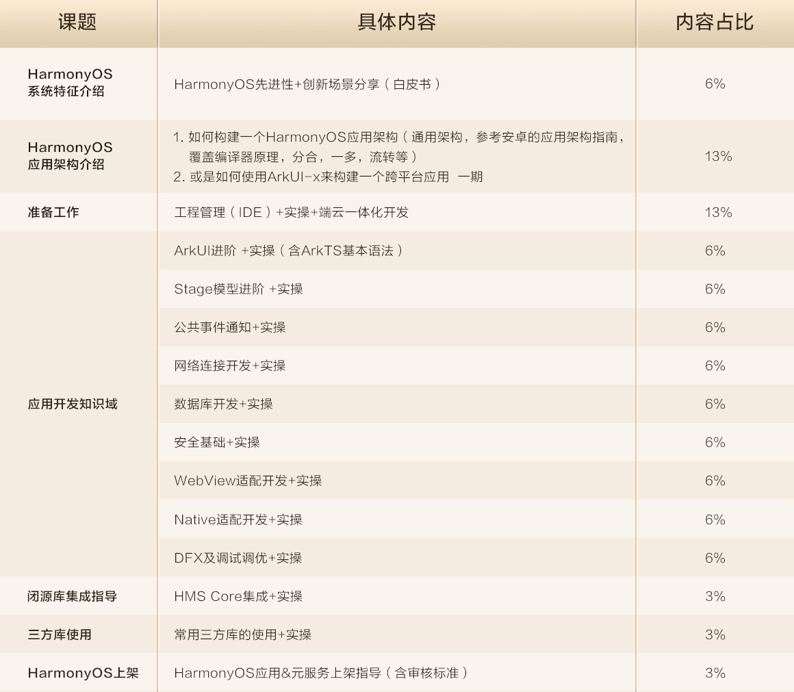

[TOC]

# HarmonyOS应用开发者高级认证知识架构

## HarmonyOS系统特征介绍 
### HarmonyOS先进性+创新场景分享(白皮书) 6%
 
## HarmonyOS应用架构介绍
### 应用架构 13% 

1. HarmonyOS应用可以兼容OpenHarmonry生态。（✅）
2. 跨端迁移和协同是哪个鸿蒙特征的能力？（自由流转）
3. 鸿蒙特征包含哪些场景化能力？
一次开发，多端部署
可分可合，自由流转
统一生态，原生智能

4. 一次开发多端部署的三个层次有哪些？
界面级一多
功能级一多
工程级一多

5. 跨端迁移和协同是哪个鸿蒙特征的能力？（统一生态）

## 准备工作 
### 工程管理(IDE)+实操+端云一体化开发 13%
1. 基于端云一体化开发，开发者需要精通前端、后端不同的开发语言。（❎）
2. 只要使用端云一体化的云端资源就需要支付费用。（❎）
3. 开发者在DevEco Studio中，可以通过什么方式使用端云一体化？（工程模板）
4. 端云一体化当期支持最低的鸿蒙API版本是？（9）
5. 端云一体化已经集成了以下哪些服务SDK？（云函数、云数据库、云存储）
6. 使用端云一体化开发，无需自己搭建服务器，并进行运维了。（✅）
7. 端云一体化工程目录结构分为哪些部分？
端开发工程（Application）
云开发工程（Cloud Program）
端侧公共库（External Libraries）

8. 端云一体化中的云函数支持哪些操作？
编写函数
测试函数
打包函数
部署函数

9. 端云一体化已经集成以下哪些服务SDK？
云函数
云数据库
云存储
云托管

## 应用开发知识域
### ArkUI进阶+实操(含ArkTS基本语法) 6%
1. 每个自定义组件都有自己的生命周期。（✅）
2. 首选项preference是以key-value形式存储数据，其中key可以重复。（❎）
3. 每调用一次router.pushUrl()方法，默认情况下，页面栈数量会加1，页面栈支持的最大页面数量为32。（❎）
4. 首选项是非关系型数据库，遵循ACID特性。（❎）
5. 在Column和Row容器组件中，alignitems用于设置子组件在主轴方向上的对齐格式，justifyContent用于设置子组件在交叉轴上的对齐格式。。（❎）
6. 所有使用@Component修饰的自定义组件都支持onPageShow，onBackPress和onPageHide生命周期函数。（❎）
7. 下面哪个方法，可以跳转到一个新页面，并销毁当前页面？（router.replaceUrl()）
8. 自定义组件的aboutToAppear()在什么时机执行？（build函数之前）
9. 关于Tabs组件页签的位置设置，下面描述错误的是？（当barPosition为End，vertical属性为true时，页签位于容器底部。）
10. 在下面哪个文件中可以设置页面的路径配置信息?（main_pages.json）
11. 关于容器组件的Row和Column，下面说法错误的是：（Row的子组件在交叉轴方向上的对齐方式使用alignltems属性来设置，其参数类型为HorizontalAlign。）
12. Row组件中有两个Text组件，如果使用justifyContent对齐方式，下面哪个属性可以实现左右两端对齐：（FlexAlign.SpaceBetween）
13. @state修饰的状态数据被修改时会触发组件的什么方法进行UI界面的更新？（build方法）
14. 下列哪个组件不能包含子组件？（LoadingProgress）
15. 下列关于ArkTS声明式开发范式的基本组成的说明正确的是？
装饰器: 用来装饰类、结构体、方法以及变量，赋予其特殊的含义，例如@Entry表示这是个入口组件。
自定义组件:可复用的UI单元，可组合其它组件。
UI描述:声明式的方法来描述UI的结构，例如build()方法中的代码块。
内置组件:ArkTS中默认内置的基本组件和布局组件，开发者可以直接调用，如Column、Text、Divider、Button等。
属性方法:用于组件属性的配置，统一通过属性方法进行设置，如fontSize()、width()、height()、color() 等。
事件方法:用于添加组件对事件的响应逻辑，统一通过事件方法进行设置，如跟随在Button后面的onClick()。

16. 下列哪些组件层次结构是正确的？
Text > Span
Button > Column > Image
Column > Row > Button

17. 每个自定义组件都有自己的生命周期。（✅）
18. 自定义组件的组件化特点有哪些？
可组合
可复用
配置化生命周期
数据驱动更新

19. 下列哪种组合方式不能实现子组件从父子组件之间双向数据同步。（ @State和@Prop） 
20. 下面哪些组件是可以滚动的?
Scroll
List
Grid

### Stage模型进阶+实操 6%
1. 关于UIAbility的启动模式，下列说法错误的是：（muliton为多实例模式，每次startAbility都会启动一个新的实例，系统默认为multition模式）
2. 下面哪些是Ability的生命周期回调函数？（onCreate、onDestroy、onForeground、onBackground）
3. UIAbility的启动模式有哪些？（singleton、specified、multition）
4. Worker线程最大同时激活数是？（8）
5. entry的module.json5中包含以下哪些信息？
应用包名和版本号信息
Ability的配置信息
应用权限申请列表

### 公共事件通知+实操 6%
1. 公共事件服务为应用程序提供了哪些能力？
订阅公共事件
发布公共事件
取消订阅公共事件

2. 公共事件从系统角度可以分为哪几种？（系统公共事件和自定义公共事件）
3. 公共事件从发送方式可以分为哪几种？（无序公共事件、有序公共事件、粘性公共事件）

### 网络连接开发+实操 6%
1. 什么模块提供了全双工通信协议（WebSocket）
2. 在http模块中，多个请求可以使用同一个httpRequest对象，httpRequest对象可以复用。（✅）
3. 订阅dataReceiveProgress响应事件是用来接收HTTP流式响应数据？（❎）
4. 向服务器提交表单数据，以下哪种请求方式比较合适？（RequestMethod.POST）
5. 下列关于request方法和requestInStream方法说法错误的是哪个？（支持传入URL地址和相关配置项。）
6. 下列关于request方法和requestInStream方法说法错误的是：（都支持HttpResponse返回值类型。）
7. 关于request方法回调函数的返回值类型下列说法正确的是：
HttpResponse类型中的header字段是JSON格式字符串。
回调函数执行成功时，HttpResponse类型中的responseCode字段为请求返回的响应码。
HttpResponse类型中的cookie字段表示服务器返回的cookies。

### 数据库开发+实操 6%

### 安全基础+实操 6%
1. HUKS中文全程是什么？（通用密钥库系统）
2. TEE是Trusted execution environment的缩写?（✅）
3. OS Kernel（操作系统内核）的安全性要强于TEE？（❎）
4. 以下哪个不是HarmonyOS安全设计理念要素？（高效性）
5. 下列哪个不是设备端侧证书（CBG根证书）
6. 以下哪些是HarmonyOS生态安全的内容？
开发者实名
设备受限调试
上架检测与审核
应用代码签名与加密
应用运行时保护与检测

### WebView适配开发+实操 6%
1. WebView在HarmonyOS中的入口是通过什么组件体现的？（Web组件）
2. 

### Native适配开发+实操 6%

### DFX及调试调优+实操 6%

## 闭源库集成指导 
### HMS Core集成+实操 3%
1. 认证服务支持下列哪种账号认证？（华为账号）

## 三方库使用 
### 常用三方库的使用+实操 3%
1. 引用ohpm三方库的包依赖是在哪个配置文件中？（oh-package.json5）
2. 

## HarmonyOS上架 
### HarmonyOS应用&元服务上架指导(含审核标准) 3%

1. 云函数打包完成后，需要到AppGallery Connect创建对应函数的出收发器才可以在端侧中调用。（✅）
2. 发布应用时需要创建Profile时，类型选中什么？（发布）
3. 发布开放式测试版本后，还需要人工审核吗？（需要）
4. 添加用户信息时，如果账号使用手机号码，以下哪种输入格式正确？（86-189****1276）
5. 应用包名不能包含一些保留字段，一下哪个字段符合规范？（.test.）
6. 发布后的鸿蒙应用可以在哪里获取？（华为应用市场）
7. 元服务包名必须以哪个字段结尾？（.hmservice）
8. 元服务创建测试用户时，用户列表存储位置需要选择？（中国）
9. 开放式测试版本发布后，受邀测试用户如何体验？（进入服务中心，打开“开发者模式”开关，在最下方的“服务测试”找到待体验的元服务）
10. 创建应用时，应用包名需要和config.json文件中哪个字段保持一致？（bundleName）
11. 发布开放式测试版本后，怎么追加测试用户？（需要重新发布新的测试版本追加用户）
12. 发布应用时需要创建证书，证书类型应选择哪一种？（发布证书）
13. 元服务包由一个或多个HAP包组成，每个HAP包不得超过多大，以提供秒开体验？（10MB）
14. 鸿蒙应用/元服务上架过程上传软件包常见的问题有哪些？
软件包中的发布Profile文件和当前上传软件包的应用不匹配
软件包中的发布证书与发布Profile文件中的发布证书不匹配
软件包未签名导制提示非法软件包
软件包中使用证书已经失效或者过期
