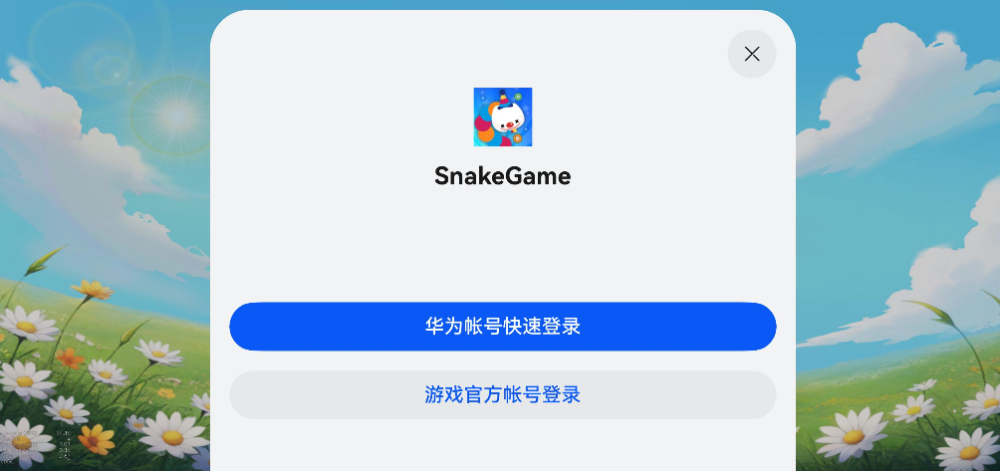

[TOC]
# Cocos Creator构建OpenHarmony工程实践

> 目前，一些游戏引擎已开放对HarmonyOS NEXT系统的支持。
其中Unity需使用[团结引擎](https://developer.unity.cn/projects/65520068edbc2a846fdbb2e3)；[Cocos Creator](https://docs.cocos.com/creator/2.4/manual/zh/publish/publish-openharmony.html) 2D、3D引擎均在一定版本以上进行支持。
这里我们以Cocos Creator 2.4.13为例，体验HarmonyOS NEXT游戏的开发流程。

## 名词解释
* OpenHarmony：是由开放原子开源基金会（OpenAtom Foundation）孵化及运营的开源项目，可理解为开源鸿蒙。
* HarmonyOS NEXT：鸿蒙操作系统星河版，纯鸿蒙内核操作系统（不支持AOSP）。
* OpenHarmony与HarmonyOS NEXT的关系：HarmonyOS NEXT：HMS + OpenHarmony
* HMS：Huawei Mobile Services（华为移动服务）

## 环境

### Cocos Creator
* Cocos Creator v3.2+ | Cocos Creator v2.4.12+
* Python2.7.5+

**注意：这里的Python版本需为2.x**

### HarmonyOS
* DevEco Studio NEXT Developer Beta1
* Runtime version: 17.0.10+1-b1087.17 x86_64
* OpenHarmony SDK vision: 5.0.0.25, apiVersion: 12
* JDK version: 22.0.1

## 前置准备
### 1. 创建应用
登录[AppGallery Connect](https://developer.huawei.com/consumer/cn/service/josp/agc/index.html)，点击“我的应用”，选中HarmonyOS，再点击“新建”来创建应用。


- “软件包类型”：选择“APP（HarmonyOS）”。
- “支持设备”：根据您的游戏所需运行设备选择。
- “应用分类”：选择“游戏”。
- “是否元服务”：否。

### 2. 生成证书
(1). 在DevEco Studio工具侧生成密钥（.p12）和证书请求文件（.csr）。

i. 在主菜单栏单击Build > Generate Key and CSR。

ii. 在Key Store File中，可以单击Choose Existing选择已有的密钥库文件（存储有密钥的.p12文件）；如果没有密钥库文件，单击New进行创建。下面以新创建密钥库文件为例进行说明。


iii. 在Create Key Store窗口中，填写密钥库信息后，单击OK。
* Key Store File：设置密钥库文件存储路径，并填写p12文件名。
* Password：设置密钥库密码，必须由大写字母、小写字母、数字和特殊符号中的两种以上字符的组合，长度至少为8位。请记住该密码，后续签名配置需要使用。
* Confirm Password：再次输入密钥库密码。

vi. 在Generate Key and CSR界面中，继续填写密钥信息后，单击Next。
* Alias：密钥的别名信息，用于标识密钥名称。请记住该别名，后续签名配置需要使用。
* Password：密钥对应的密码，与密钥库密码保持一致，无需手动输入。
* Validity：证书有效期，建议设置为25年及以上，覆盖应用/服务的完整生命周期。
* Certificate：输入证书基本信息，如组织、城市或地区、国家码等，这里我们直接填CN即可。


v. 在Generate Key and CSR界面，设置CSR文件存储路径和CSR文件名。
**注意：这里的CSR文件名需以.csr结尾。**


vi. 点击Finish，创建CSR文件成功，可以在存储路径下获取生成的密钥库文件（.p12）和证书请求文件（.csr）。

(2). 申请应用证书（.cer）、Profile（.p7b）文件，用于后续调试工作。
i. 登录[AppGallery Connect](https://developer.huawei.com/consumer/cn/service/josp/agc/index.html)，选择“用户与访问”，在左边栏选择“证书管理”，点击“新增证书”。


ii. 在弹出的“新增证书”窗口填写要申请的证书信息，点击“提交”。


CSR文件选择之前从DevEco生成的.csr文件。

iii. 证书申请成功后，“证书管理”页面展示证书名称等信息。点击“下载”，将生成的证书（.cer）保存至本地，供后续签名使用。

iv. 在“我的项目”中找到创建的项目，在左侧导航栏选择“HarmonyOS应用 > HAP Provision Profile管理”，点击右上角“添加”，对应添加相关信息后提交即可生成Profile文件（.p7b）。


v. 发布Profile申请成功后，“管理HAP Provision Profile”页面展示Profile名称、类型等信息。点击“下载”，将生成的Profile保存至本地，供后续签名使用。

### 3. 配置应用签名证书指纹
AGC自动生成证书对应的公钥摘要信息并计算出对应的SHA256指纹，配置应用签名证书指纹具体操作请参见配置应用签名证书指纹。
(1). 打开终端，执行命令keytool -list -v -keystore <keystore-file>，按命令行提示进行操作。<keystore-file>为应用/元服务签名证书的完整路径。
例如：
> keytool -list -v -keystore /Users/xxxxxx/Downloads/myApplication.p12


**注意：如果生成时报错，则可能是JDK版本过低导致，需前往[Oracle官网](https://www.oracle.com/cn/java/technologies/downloads/#jdk22-mac)下载更新**

(2). 再打开DevEco Studio，点击Flie->Project Structure进入配置工程的签名信息的界面，点击“Store file(*.p12)”后的指纹图标。


(3). 弹出的“Certificate Fingerprint”窗口将展示自动生成的签名证书指纹，复制保存此信息。

(4). 在[AppGallery Connect](https://developer.huawei.com/consumer/cn/service/josp/agc/index.html)，点击“我的项目”，在“项目设置 > 常规”页面的“应用”区域，点击“SHA256证书/公钥指纹”后的“添加证书指纹”，保存即可。


到这里，前置准备完毕。

## 导出OpenHarmony工程
这里我们使用官方给出的[游戏Demo](https://gitee.com/petal-gaming-services/2024-hdccocos-demo)工程进行操作。

1. 使用Cocos Creator打开Demo工程，并打开“assets\Script”路径下的“start”脚本文件。
2. 在login函数中，调用“globalThis.oh.postMessage”发起“login”请求，并在onLogin方法中接收系统返回的登录结果。登录成功后，跳转到游戏界面。

```ts
async login() {
        globalThis.oh.postMessage("login", "");
        const result = await this.onLogin();
        let ResultData = JSON.parse(result);
        if (ResultData.code == "0") {
            cc.director.loadScene("game");
            console.log("cocos login success");
        } else {
            console.log("login failed,code is" + ResultData.code + ",errorMessage is" + ResultData.message);
        }
    }

    onLogin():Promise<string> {
        return new Promise((resolve, reject) => {
            jsb["gameJsOnMessage"] = (type, data) => {
                switch (type) {
                    case "login":
                        console.log("cocos:", data);
                        resolve(data);
                        break;

                    default:
                        break;
                }
            }
        })
    }
```

3. 在Cocos Creator顶部栏选择“项目”，点击“构建发布”，在Editor Window页面中，“发布平台”选择“OpenHarmony”，“应用ID名称”配置为创建HarmonyOS应用时对应的包名。点击构建，待构建完毕后即可生成OpenHarmony工程，其路径为：./build/jsb-link/frameworks/runtime-src/proj.openharmony


## OpenHarmony工程配置

### 参数配置
1. 使用DevEco Studio打开proj.openharmony工程，点击左上角菜单“File > Sync and Refresh Project”，同步构建项目，同步时，如果左侧栏提示报错，点击“Migrate Assistant”，等待构建完成。
2. 接入SDK接口之前，打开工程中entry模块下的module.json5文件，新增metadata并配置client_id和app_id（从AppGallery获取）。

```ts
"module": {
  "name": "entry",
  "type": "xxx",
  "description": "xxxx",
  "mainElement": "xxxx",
  "deviceTypes": [],
  "pages": "xxxx",
  "abilities": [],
  "metadata": [ 
    {
      "name": "client_id",
      "value": "xxxxxx" 
    },
    {
      "name": "app_id",
      "value": "xxxxxx"  
    }
  ]
}
```

### 游戏初始化
1. 打开entry\src\main\ets\entryability下的EntryAbility.ts文件，导入Game Service Kit模块及相关公共模块。
2. 在游戏调用登录接口之前，先调用gamePlayer.init接口进行游戏业务的初始化，该接口的调用时机要在EntryAbility.ts的windowStage.loadContent成功之后。

```ts
windowStage.loadContent("pages/index", (err, data) => {
   try {
     gamePlayer.init(this.context,()=>{
       hilog.info(0x0000, 'testTag', `Succeeded in initing.`);
     });
   } catch (error) {
     hilog.error(0x0000, 'testTag', `Failed to init. Code: ${error.code}, message: ${error.message}`);
     promptAction.showToast({
          message: `Failed to init. Code: ${error.code}, message: ${error.message}`,
          duration: 500
        });
   }
 });
```

### 联合登录
初始化成功后，游戏通过调用联合登录接口进行登录，Game Service Kit向玩家展示联合登录弹框。

1. 打开entry\src\main\ets\pages下的index.ets文件，导入Game Service Kit模块及相关公共模块，并定义登录结果数据类。

```ts
import { gamePlayer } from '@kit.GameServiceKit';
import { common } from '@kit.AbilityKit';
import { hilog } from '@kit.PerformanceAnalysisKit';
import { BusinessError } from '@kit.BasicServicesKit';
import { promptAction } from '@kit.ArkUI';

class LoginData{ // 联合登录结果数据结构
  code:number = -1;
  message:string = "";
}
```

2. 在index.ets文件的struct Index结构中，添加`unionLogin()`联合登录代码。

```ts
@Entry
@Component
struct Index {
    ... // 此处为未展示的原有代码片段
    private loginData:LoginData = new LoginData();
   
    async unionLogin():Promise<string> {
        hilog.info(0x0000, 'testTag', `union login.`);
        let context = getContext(this) as common.UIAbilityContext;
        let thirdAccountInfo: gamePlayer.ThirdAccountInfo = {
          'accountName': '游戏官方帐号登录', // 游戏官方帐号名
          'accountIcon': $r('app.media.icon'), // 游戏官方帐号图标资源信息
        };
        let request: gamePlayer.UnionLoginParam = {
          showLoginDialog: true, // 当需要切换帐号或进行其他操作时，请将此值设置为true
          loginPanelType: 1,
          thirdAccountInfos: [
            thirdAccountInfo
          ]
        };
        return new Promise((resolve, reject) => {
          gamePlayer.unionLogin(context, request).then((result: gamePlayer.UnionLoginResult) => {
            hilog.info(0x0000, 'testTag', `Succeeded in logining.`);
            let accountName = result.accountName;
            this.loginData.code = 0;
            this.loginData.message = "Succeeded in logining.";
            promptAction.showToast({
              message: "Succeeded in logining.",
              duration: 500
             });
            resolve(JSON.stringify(this.loginData));
          }).catch((error: BusinessError) => {
            hilog.error(0x0000, 'testTag', `Failed to login. Code: ${error.code}, message: ${error.message}`);
            this.loginData.code = error.code;
            this.loginData.message = error.message;
            promptAction.showToast({
              message: JSON.stringify(this.loginData),
              duration: 500
            });
            reject(JSON.stringify(this.loginData));
          });
        });
      }
    }
```

### 与Cocos引擎进行交互
1. 在entry\src\main\ets\common\Constants.ts的ContextType结构中，增加SDK_UTILS枚举类型。

```ts
export enum ContextType {
  ... ,
  SDK_UTILS
}
```

2. 在entry\src\main\cpp\types\libcocos\index.d.ts的`context`结构中，增加`gameMsgHandle()`函数声明。

```ts
interface context {
  ... ,
  gameMsgHandle:(name:string,param:string)=>void;
}
```

3. Cocos Creator导出的OpenHarmony工程内部封装了`worker`通信逻辑，可实现游戏引擎和系统API之间的消息传递。我们需要在entry\src\main\ets\pages下的index.ets文件`aboutToAppear()`方法中，通过`this.workPort._messageHandle`接收Cocos引擎消息：在switch结构中添加`login`类型，用于接收引擎侧发送的`login`消息类型，调用联合登录接口，并将联合登录结果发送给worker子线程。

```ts
case "login":{
          try {
            result = await this.unionLogin();
            this.workPort.postMessage("login", result);
          }catch (e){
            result = e;
            this.workPort.postMessage("login", result);
          }
          break;
}
```

4. 在entry\src\main\ets\workers\cocos_worker.ts中，通过getContext函数获取到SDK_UTILS对应的底层实现函数，并拿到对应底层实现函数的挂载对象nativeSdkUtil 。

```ts
const nativeSdkUtil = cocos.getContext(ContextType.SDK_UTILS);
```

5. 在cocos_worker.ts文件的`uiPort._messageHandle()`中，增加`login`消息处理逻辑，用于将主线程的登录结果传递给Cocos游戏侧。

```ts
case "login":
   nativeSdkUtil.gameMsgHandle(msg.name, msg.param);
   break;
```

## 打包测试
完成以上配置，我们就可以构建出包进行测试了。

1. 点击“File > Project Structure”，选择“Signing Configs”页签，勾选“Support HarmonyOS”，并根据已生成的签名证书，配置相关签名信息。


1. PC连接HarmonyOS NEXT手机，在工具栏点击运行。安装后，打开游戏并点击“登录”按钮，登录华为帐号后，弹出华为联合登录弹窗。
2. 登录成功后，弹出提示“Succeeded in logining.”，并成功跳转进入游戏主界面。



3. 完成测试运行后，我们可以构建出包，选中“Build” -> “Build Hap(s)/APP(s)” -> "Build APP(s)"即可生成`.app`文件。后续可上传到AppGallery进行内测和发布。

至此，我们完成了Cocos Creator导出OpenHarmony工程并运行打包的整个流程，并集成了联合登录功能。

## 参考
[Game Service](https://developer.huawei.com/consumer/cn/doc/harmonyos-references-V5/gameservice-gameplayer-V5)
[Codelabs](https://developer.huawei.com/consumer/cn/codelabsPortal/serviceTypes)