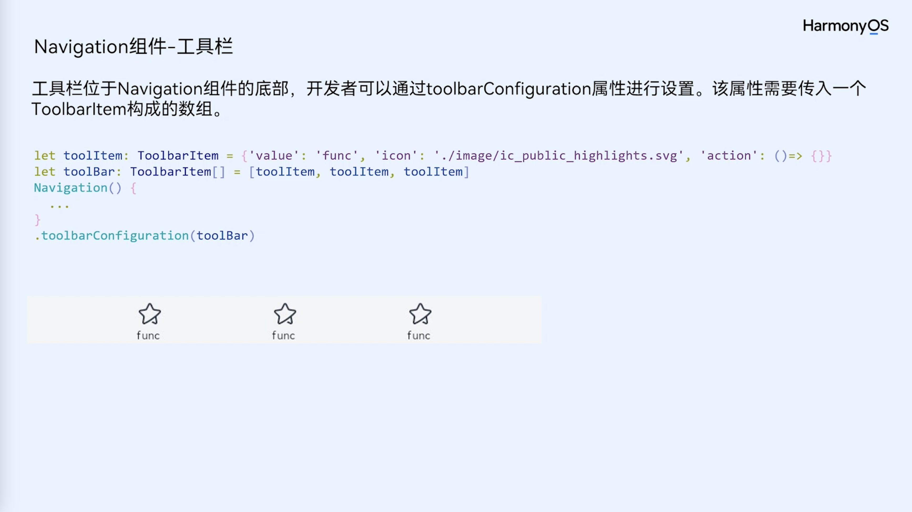
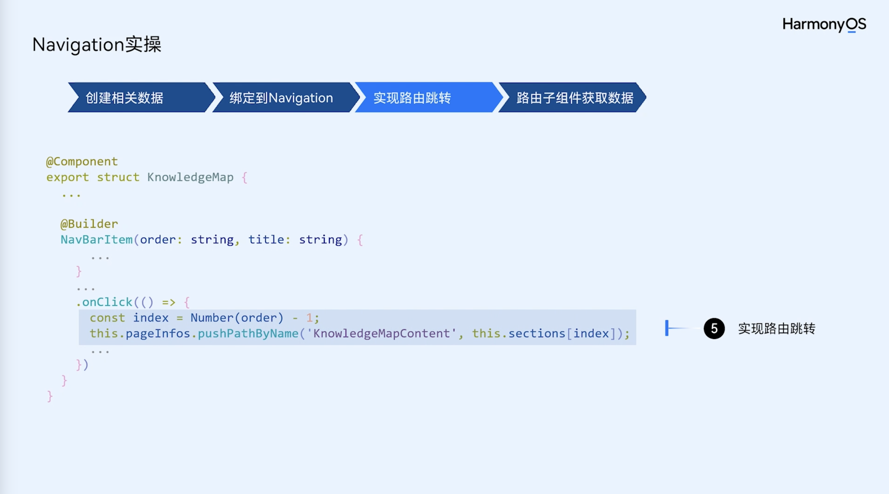

[TOC]

# 【拥抱鸿蒙】HarmonyOS NEXT深入理解路由容器之Navigation

## 什么是Navigation？
Navigation是ArkUI中的路由容器组件，一般作为首页的根容器，适用于模块内和跨模块的路由切换。支持一次开发，多端部署场景。

Navigation组件适用于模块内页面切换，通过组件级路由能力实现更加自然流畅的转场体验，是官方推荐的导航组件（相较于Router，Navigation的支持面更广，也更适合实现一多，所以建议使用Navigation）。

看到这里，很多iOS开发者可能比较熟悉，这个组件类似于iOS中的UINavigationController，可以用于根控制器实现页面的跳转和传值，同时可以实现系统或自定义标题栏、导航Item等，我们可以在Navigation中看到这些特性。

## Navigation的组成
Navigation包含导航页（NavBar）和子页（NavDestination）。
导航页又包含以下三个部分：

* 标题栏(Titlebar，包含菜单栏menu)：通过title属性设置标题。
* 内容区(Navigation子组件)：默认首页显示导航内容（Navigation的子组件）或非首页显示（NavDestination的子组件），首页和非首页通过路由进行切换。
* 工具栏(Toolbar)：通过toolbarConfiguration实现对工具栏的配置。


上图所示为单页面模式布局示意图，左边为导航页，右边为子页，可以通过路由转换实现页面跳转。

1. 标题栏

标题栏有两种模式，分别为Mini和Full，可以控制标题显示的突出程度。

2. 菜单栏

菜单栏可以设置Navigation的右上角菜单按钮的样式和点击事件。

3. 工具栏

工具类是Navigation底部的操作按钮，可以设置多个ToolBarItem。

## 路由跳转

Navigation路由跳转相关操作是基于页面栈`NavPathStack`提供的方法进行，每个Navigation都需要创建并传入一个`NavPathStack`对象，用于管理页面。

NavPathStack通过push、pop、remove等操作控制页面的入栈和出栈，从而完成页面的跳转。

路由跳转的方式：

### 1. 跳转
* 通过页面的name去跳转，并可以携带参数；

```ts
this.pageStack.pushPath({ name: "PageOne", param: "PageOne Param" })
this.pageStack.pushPathByName("PageOne", "PageOne Param")
```

* 带返回回调的跳转，跳转时添加onPop回调，能在页面出栈时获取返回信息，并进行处理；

```ts
this.pageStack.pushPathByName('PageOne', "PageOne Param", (popInfo) => {
    console.log('Pop page name is: ' + popInfo.info.name + ', result: ' + JSON.stringify(popInfo.result))
});
```

* 带错误码的跳转，跳转结束会触发异步回调，返回错误码信息

```ts
this.pageStack.pushDestinationByName('PageOne', "PageOne Param")
.catch((error: BusinessError) => {
    console.error(`Push destination failed, error code = ${error.code}, error.message = ${error.message}.`);
}).then(() => {
    console.error('Push destination succeed.');
});
```

### 2. 返回

```ts
// 返回到上一页
this.pageStack.pop()
// 返回到指定页面
this.pageStack.popToName("PageOne")
// 返回到index为1的页面
this.pageStack.popToIndex(1)
// 返回到根页面（清除栈中所有页面）
this.pageStack.clear()
```

### 3. 替换

```ts
// 将栈顶页面替换为PageOne
this.pageStack.replacePath({ name: "PageOne", param: "PageOne Param" })
this.pageStack.replacePathByName("PageOne", "PageOne Param")
```

### 4. 删除

```ts
// 删除栈中name为PageOne的所有页面
this.pageStack.removeByName("PageOne")
// 删除指定索引的页面
this.pageStack.removeByIndexes([1,3,5])
```

### 5. 参数获取

```
// 获取栈中所有页面name集合
this.pageStack.getAllPathName()
// 获取索引为1的页面参数
this.pageStack.getParamByIndex(1)
// 获取PageOne页面的参数
this.pageStack.getParamByName("PageOne")
// 获取PageOne页面的索引集合
this.pageStack.getIndexByName("PageOne")
```

### 6. 路由拦截
页面栈提供了`setInterception`方法用于页面拦截，在willShow回调中通过修改路由栈来实现路由拦截重定向的能力。

```ts
this.pageStack.setInterception({
  willShow: (from: NavDestinationContext | "navBar", to: NavDestinationContext | "navBar",
    operation: NavigationOperation, animated: boolean) => {
    if (typeof to === "string") {
      console.log("target page is navigation home page.");
      return;
    }
    // 将跳转到PageTwo的路由重定向到PageOne
    let target: NavDestinationContext = to as NavDestinationContext;
    if (target.pathInfo.name === 'PageTwo') {
      target.pathStack.pop();
      target.pathStack.pushPathByName('PageOne', null);
    }
  }
})
```


## Demo实现

为了搞清楚跳转的细节，我们可以创建一个简单的Demo，实现跳转、返回、替换以及跳转到根页面。
Demo中有Index、Page0-Page2四个页面。

* 在Index页面，实现跳转下一页功能；

```ts
import { BusinessError } from '@kit.BasicServicesKit';
import { PageUtils } from '../utils/PageUtils';
import { Page0 } from './Page0';
import { Page1 } from './Page1';
import { Page2 } from './Page2';

@Entry
@Component
struct Index {
  @State currentIndex: number = 0;
  private tabsController: TabsController = new TabsController();
  // 创建一个页面栈对象并传入Navigation
  @Provide('pageStack') pageStack: NavPathStack = new NavPathStack()

  @Builder
  pageMap(name: string) {
    if (name === 'Index') {
      Index()
    } else if(name === 'Page0') {
      Page0()
    } else if (name === 'Page1') {
      Page1()
    } else if (name === 'Page2') {
      Page2()
    }
  }
  
  build() {
    Navigation(this.pageStack) {
      Column() {
        Blank(50)
        Button("下一页")
          .onClick(() => {
            let pathInfo : NavPathInfo = new NavPathInfo('Page0', "A");
            this.pageStack.pushDestination(pathInfo);
          })
        Blank(50)
        Text(PageUtils.getPageStackInfo(this.pageStack))
      }
    }
    .title("Index")
    .navDestination(this.pageMap)

  }

}
```

首页使用`Navigation`组件并传入页面栈对象`this.pageStack`，其中，`pageMap`必须予以实现，否则无法正确跳转。在首页使用`@Provide('pageStack')` 创建一个页面栈对象并传入Navigation，方便其他页面接收。整个跳转与返回的过程由该页面栈控制。


* 在Page0页面，实现跳转下一个和返回功能；

```ts
import { PageUtils } from '../utils/PageUtils';

@Component
export struct Page0 {
  @Consume('pageStack') pageStack: NavPathStack;

  build() {

    NavDestination() {
      Column() {
        Blank(50)
        Button("下一页")
          .onClick(() => {
            this.pageStack.pushPathByName('Page1', "B", (popInfo) => {
              console.log('Pop page name is: ' + popInfo.info.name + ', result: ' + JSON.stringify(popInfo.result))
            });
          })
        Blank(50)
        Button("返回")
          .onClick(() => {
            this.pageStack.pop("agree", true);
          })
        Blank(50)
        Text(PageUtils.getPageStackInfo(this.pageStack))
      }
    }
    .title('Page0')
  }
}
```
子页面需使用`NavDestination`组件。这里，我们通过`@Consume('pageStack') pageStack: NavPathStack;`获取首页创建的页面栈，用于操作页面跳转，这里的`pageStack`需要也创建时使用的key一致。


当然，这种获取页面栈的方式是有耦合的，我们还可以通过`OnReady`回调获取：

```ts
@Component
export struct PageOne {
  pathStack: NavPathStack = new NavPathStack()

  build() {
    NavDestination() {
      ...
    }.title('PageOne')
    .onReady((context: NavDestinationContext) => {
      this.pathStack = context.pathStack
    })
  }
}
```
另外还可以通过全局AppStorage接口设置获取以及自定义组件查询接口获取。我们可以根据实际情况选取适合的方式。

* 在Page1页面，实现跳转下一个、返回及页面替换功能；

```ts
import { PageUtils } from '../utils/PageUtils';

@Component
export struct Page1 {
  @Consume('pageStack') pageStack: NavPathStack;

  build() {
    NavDestination() {
      Column() {
        Blank(50)
        Button("下一页")
          .onClick(() => {
            this.pageStack.pushPathByName('Page2', "C", (popInfo) => {
              console.log('Pop page name is: ' + popInfo.info.name + ', result: ' + JSON.stringify(popInfo.result))
            });
          })
        Blank(50)
        Button("返回")
          .onClick(() => {
            this.pageStack.pop()
          })
        Blank(50)
        Button("替换 By name")
          .onClick(() => {
            this.pageStack.replacePathByName("Page0", "替换到Page0");
          })
        Blank(50)
        Text(PageUtils.getPageStackInfo(this.pageStack))
      }
    }
    .title('Page1')
  }
}
```

这样，我们就可以实现页面跳转。



* 在Page2页面，实现返回及返回根页面功能。

```
import { PageUtils } from '../utils/PageUtils';

@Component
export struct Page2 {
  @Consume('pageStack') pageStack: NavPathStack;

  build() {
    NavDestination() {
      Column() {
        Blank(50)
        Button("返回")
          .onClick(() => {
            this.pageStack.pop()
          })
        Blank(50)
        Button("返回根视图")
          .onClick(() => {
            this.pageStack.clear()
          })
        Blank(50)
        Text(PageUtils.getPageStackInfo(this.pageStack))
      }
    }
    .title("Page2")
  }
}
```


其中，`PageUtils`是用于获取页面栈信息的工具类，其实现如下：

```ts

export class PageUtils {

  static getPageStackInfo(pageStack: NavPathStack): string {

    let res: string = "";
    let pathNames = pageStack.getAllPathName();
    for (let index = 0; index < pathNames.length; index++) {
      const pathName = pathNames[index];
      const pathIndex = pageStack.getIndexByName(pathName);

      res += `page name: ${pathName}, `;
      res += `index: ${pathIndex}, `;
      res += `param: ${pageStack.getParamByName(pathName)}`;
      res += "\n";
    }

    return res;
  }

}
```

通过`pageStack.getParamByName()`获取到参数信息。


运行效果示例：


为了了解页面栈信息，在Demo中分别打印了页面名称、index以及参数信息。
可以看出，index是从0随着`push()`递增，遵从先进后出原则，当使用`replace()`进行页面替换时，一个页面对应多个index；当调用`clear()`时，页面栈被清空，返回到根页面。

## Navigation导航下的页面生命周期
Navigation作为路由容器，其生命周期承载在NavDestination组件上，以组件事件的形式开放。

其生命周期如下图所示：


* aboutToAppear：在创建自定义组件后，执行其build()函数之前执行（NavDestination创建之前），允许在该方法中改变状态变量，更改将在后续执行build()函数中生效。
* onWillAppear：NavDestination创建后，挂载到组件树之前执行，在该方法中更改状态变量会在当前帧显示生效。
* onAppear：通用生命周期事件，NavDestination组件挂载到组件树时执行。
* onWillShow：NavDestination组件布局显示之前执行，此时页面不可见（应用切换到前台不会触发）。
* onShown：NavDestination组件布局显示之后执行，此时页面已完成布局。
* onWillHide：NavDestination组件触发隐藏之前执行（应用切换到后台不会触发）。
* onHidden：NavDestination组件触发隐藏后执行（非栈顶页面push进栈，栈顶页面pop出栈或应用切换到后台）。
* onWillDisappear：NavDestination组件即将销毁之前执行，如果有转场动画，会在动画前触发（栈顶页面pop出栈）。
* onDisappear：通用生命周期事件，NavDestination组件从组件树上卸载销毁时执行。
* aboutToDisappear：自定义组件析构销毁之前执行，不允许在该方法中改变状态变量。


**最后，我们需要知道，官方推荐使用Navigation，原先使用Router的应用，建议尽快切换Navigation，避免由于页面的持续增加导致迁移工作量变大。**

以上就是Navigation相关的一些基础内容，由于大篇幅不适合阅读与分享，后续会继续整理自定义路由、页面监听和Router切换Navigation等方面内容，希望能提供一些参考和思路引导。


